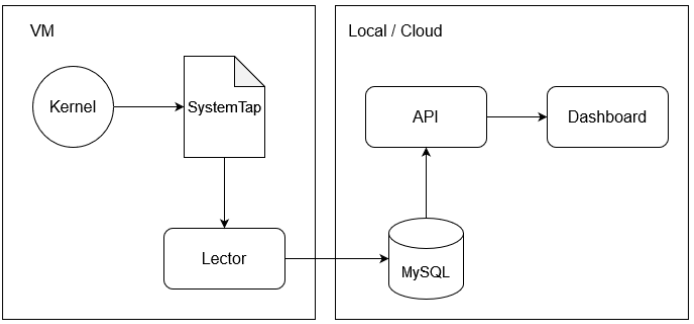

# SISTEMAS OPERATIVOS 2 - PROYECTO

## Integrantes
|NOMBRE|CARNET|
|:----------|:----------:|
|Alexis Marco Tulio López Cacoj|	201908359|
|Juan Sebastian Julajuj Zelada|	201905711|

## Objetivos
* Entender cómo funcionan el manejo de memoria en Linux.
* Comprender como funcionan las solicitudes de memoria de los procesos.
* Realizar reportes sobre la utilización de memoria.

## Descripción
La gestión de la memoria es un aspecto crítico del rendimiento del sistema, ya que garantiza la utilización eficiente de los recursos y mantiene la estabilidad bajo diferentes cargas de trabajo. Al monitorear exhaustivamente la memoria, se puede obtener información valiosa sobre el comportamiento de su sistema, identificar posibles cuellos de botella y optimizar la asignación de recursos.

En este proyecto se creara una aplicación capaz de monitorear el uso de memoria de cada proceso 
abierto en Linux, detectando las solicitudes de memoria que estos realizan al sistema operativo.

## Arquitectura

 

    

 

## Backend

#### Importación de Módulos

    import express from 'express';
    import mysql from 'mysql2/promise';
    import dotenv from 'dotenv';
    import http from 'http';
    import { Server } from 'socket.io';
    import cors from 'cors';
    Estos son los módulos necesarios:

* express: Framework para manejar solicitudes HTTP.
* mysql2/promise: Para conectar y hacer consultas a MySQL usando promesas.
* dotenv: Para cargar variables de entorno desde un archivo .env.
* http: Para crear un servidor HTTP.
* socket.io: Para manejar la comunicación en tiempo real.
* cors: Para manejar políticas de CORS.

#### Configuración de Variables de Entorno

    dotenv.config();
  
Carga las variables de entorno desde un archivo .env.

#### Configuración Inicial

    const app = express();
    const port = process.env.PORT || 3000;

Crea una instancia de Express y define el puerto en el que el servidor escuchará.

#### Creación del Servidor HTTP y Configuración de Socket.IO

    const server = http.createServer(app);
    const io = new Server(server, {
      cors: {
        origin: 'http://localhost:5173',
        methods: ['GET', 'POST'],
      },
    });
    
Crea un servidor HTTP utilizando Express y configura Socket.IO con CORS permitiendo solicitudes desde http://localhost:5173.

#### Middleware

    app.use(express.json());
    app.use(cors({
      origin: 'http://localhost:5173',
      methods: ['GET', 'POST'],
      allowedHeaders: ['Content-Type'],
    }));

Configura middleware para manejar JSON y CORS.

#### Configuración de la Conexión a la Base de Datos

    const dbConfig = {
      host: process.env.DB_HOST,
      user: process.env.DB_USER,
      password: process.env.DB_PASS,
      database: process.env.DB_NAME,
    };
    
Define la configuración de la base de datos utilizando variables de entorno.

#### Conexión a la Base de Datos

let connection;

    async function connectToDatabase() {
      try {
        connection = await mysql.createConnection(dbConfig);
        console.log('Conectado a la base de datos MySQL');
      } catch (error) {
        console.error('Error al conectar a la base de datos:', error);
      }
    }
    
    connectToDatabase();
    
Función asincrónica para conectar a la base de datos MySQL.

#### Función para Emitir Actualizaciones en Tiempo Real

    async function emitUpdates() {
      try {
        const [processes] = await connection.execute(`
          SELECT 
            pid, 
            process_name, 
            GREATEST(SUM(CASE WHEN my_call = 'mmap' THEN memory_size ELSE 0 END) - SUM(CASE WHEN my_call = 'munmap' THEN memory_size ELSE 0 END), 0) AS memory_used,
            (GREATEST(SUM(CASE WHEN my_call = 'mmap' THEN memory_size ELSE 0 END) - SUM(CASE WHEN my_call = 'munmap' THEN memory_size ELSE 0 END), 0) / ${TOTAL_MEMORY_SYSTEM}) * 100 AS memory_percentage
          FROM 
            memory_usage
          GROUP BY 
            pid, process_name
        `);
    
        const [memoryRequests] = await connection.execute(`
          SELECT 
            pid, 
            process_name, 
            my_call, 
            memory_size, 
            timestamp 
          FROM 
            memory_usage
        `);
    
        const [pieChartData] = await connection.execute(`
          SELECT 
            process_name, 
            SUM(memory_size) AS total_memory
          FROM 
            memory_usage
          WHERE 
            my_call = 'mmap'
          GROUP BY 
            process_name
          ORDER BY 
            total_memory DESC
        `);
    
        const totalMemoryQuery = await connection.execute(`
          SELECT SUM(memory_size) AS total_memory
          FROM memory_usage
          WHERE my_call = 'mmap'
        `);
    
        const totalMemory = totalMemoryQuery[0][0].total_memory;
        const otherMemory = totalMemory - pieChartData.reduce((sum, row) => sum + row.total_memory, 0);
    
        if (pieChartData.length === 10 && otherMemory > 0) {
          pieChartData.push({ process_name: 'Others', total_memory: otherMemory });
        }
    
        io.emit('update', { processes, memoryRequests, pieChartData });
      } catch (error) {
        console.error('Error al emitir actualizaciones:', error);
      }
    }
    
Esta función obtiene datos de la base de datos y emite actualizaciones a los clientes conectados mediante Socket.IO.

#### Configuración de Socket.IO

    io.on('connection', (socket) => {
      console.log('Cliente conectado');
      emitUpdates();
    
      socket.on('disconnect', () => {
        console.log('Cliente desconectado');
      });
    });
    
Configura Socket.IO para manejar conexiones y desconexiones de clientes.

#### Emitir Actualizaciones Periódicamente

    setInterval(emitUpdates, 1000);
    Configura un intervalo para emitir actualizaciones cada segundo.
    
    Iniciar el Servidor
    javascript
    Copiar código
    server.listen(port, () => {
      console.log(`Servidor escuchando en http://localhost:${port}`);
    });
    
Inicia el servidor y escucha en el puerto configurado.

## Modulo en C

#### Definición de Macros y Bibliotecas Incluidas

    #define _XOPEN_SOURCE 700
    #include <stdio.h>
    #include <stdlib.h>
    #include <string.h>
    #include <mysql/mysql.h>
    #include <time.h>

* _XOPEN_SOURCE 700: Para habilitar ciertas funciones POSIX.
* stdio.h, stdlib.h, string.h, mysql/mysql.h, time.h: Bibliotecas estándar y MySQL para el manejo de entrada/salida, memoria, cadenas, conexión a MySQL y tiempo respectivamente.

#### Constantes y Declaraciones de Funciones

    #define BUFFER_SIZE 2048
    
    void finish_with_error(MYSQL *con)
    {
        fprintf(stderr, "%s\n", mysql_error(con));
        mysql_close(con);
        exit(1);
    }

* BUFFER_SIZE: Define el tamaño del buffer a 2048 bytes.
* finish_with_error: Maneja errores de MySQL cerrando la conexión y saliendo del programa.

#### Obtener Memoria Total

    unsigned long get_total_memory()
    {
        FILE *fp;
        char buffer[BUFFER_SIZE];
        unsigned long total_memory = 0;
    
        fp = fopen("/proc/meminfo", "r");
        if (fp == NULL)
        {
            perror("Error al abrir /proc/meminfo");
            exit(1);
        }
    
        while (fgets(buffer, BUFFER_SIZE, fp) != NULL)
        {
            if (sscanf(buffer, "MemTotal: %lu kB", &total_memory) == 1)
            {
                total_memory *= 1024; // Convertir a bytes
                break;
            }
        }
    
        fclose(fp);
        return total_memory;
    }
    
* get_total_memory: Lee la memoria total del sistema desde /proc/meminfo y la devuelve en bytes.

  
#### Formatear Timestamps

    void format_timestamp(char *input, char *output, size_t output_size)
    {
        struct tm tm;
        time_t t;
        char buffer[BUFFER_SIZE];
    
        if (strptime(input, "%a %b %d %H:%M:%S %Y", &tm) == NULL)
        {
            fprintf(stderr, "Error al analizar la fecha: %s\n", input);
            exit(1);
        }
    
        t = mktime(&tm);
        if (t == -1)
        {
            fprintf(stderr, "Error al convertir la fecha a time_t: %s\n", input);
            exit(1);
        }
    
        if (strftime(buffer, sizeof(buffer), "%Y-%m-%d %H:%M:%S", localtime(&t)) == 0)
        {
            fprintf(stderr, "Error al formatear la fecha: %s\n", input);
            exit(1);
        }
    
        strncpy(output, buffer, output_size);
    }
    
* format_timestamp: Convierte un timestamp de entrada en el formato deseado (%Y-%m-%d %H:%M:%S).

#### Cargar Variables de Entorno

    void load_env(const char *filename)
    {
        FILE *file = fopen(filename, "r");
        if (!file)
        {
            perror("Error al abrir el archivo .env");
            exit(1);
        }
    
        char line[BUFFER_SIZE];
        while (fgets(line, sizeof(line), file))
        {
            char *key = strtok(line, "=");
            char *value = strtok(NULL, "\n");
            if (key && value)
            {
                setenv(key, value, 1);
            }
        }
    
        fclose(file);
    }
    
* load_env: Carga variables de entorno desde un archivo .env.

## Modulo monitor de memoria

#### Shebang Line:

    #!/usr/bin/stap
    
Esta línea indica al sistema que use el intérprete stap (SystemTap) para ejecutar el script.

#### Probe para mmap2:

    probe syscall.mmap2 {
        printf("%s,%d,%s,%d,%s\n", "mmap", pid(), execname(), length, ctime(gettimeofday_s()-21600));
    }
    
Este bloque define un probe para la llamada al sistema mmap2. Cada vez que se llama a mmap2, se ejecuta el código dentro de este probe:

* printf: Imprime los datos especificados en formato CSV.
* "mmap": Cadena literal que indica el tipo de llamada.
* pid(): ID del proceso que hizo la llamada.
* execname(): Nombre del proceso que hizo la llamada.
* length: Longitud del segmento de memoria asignado.
* ctime(gettimeofday_s()-21600): Tiempo en formato legible restando 21600 segundos (6 horas) para ajustar la zona horaria si es necesario.

#### Probe para munmap:

    probe syscall.munmap {
        printf("%s,%d,%s,%d,%s\n", "munmap", pid(), execname(), length, ctime(gettimeofday_s()-21600));
    }
    
Similar al probe anterior, este bloque define un probe para la llamada al sistema munmap. Cada vez que se llama a munmap, se ejecuta el código dentro de este probe:

* "munmap": Cadena literal que indica el tipo de llamada.
* pid(): ID del proceso que hizo la llamada.
* execname(): Nombre del proceso que hizo la llamada.
* length: Longitud del segmento de memoria liberado.
* ctime(gettimeofday_s()-21600): Tiempo en formato legible restando 21600 segundos (6 horas) para ajustar la zona horaria si es necesario.

